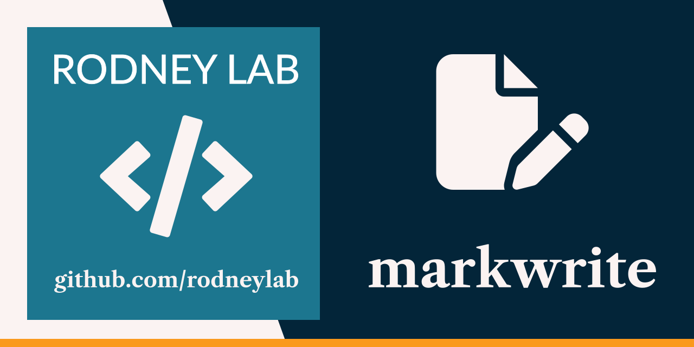

  

<h1 align="center">
  markwrite
</h1>

CLI tool intended to run in the background generating HTML each time a watched Markdown file is saved.

Features:

- adds an id and anchor link to each h2 heading for easy linking
- adds pretty punctuation
- uses html5ever for HTML manipulation and pulldown-cmark for Markdown parsing

> **Warning**
> 🚧 Work in progress

## 🗺️ Roadmap

- [ ] add spelling, punctuation and grammar check
- [x] add debouncing
- [x] output statistics, such as word count
- [ ] serve output HTML locally for previewing document

## ☎️ Reach Out

Feel free to jump into the
[Rodney Lab matrix chat room](https://matrix.to/#/%23rodney:matrix.org).
